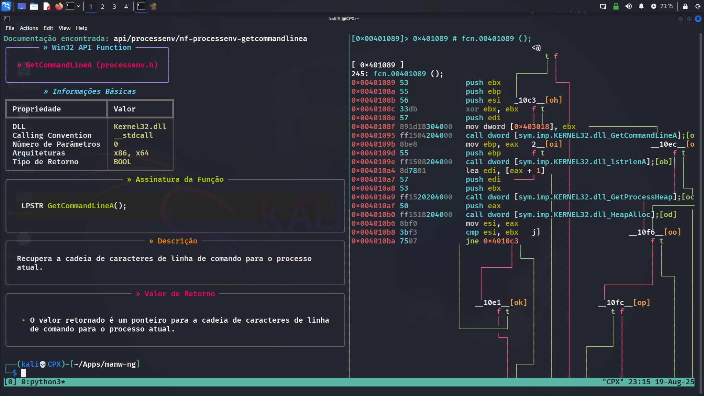

# MANW-NG: Win32 API Documentation Scraper

[](https://opensource.org/licenses/MIT)
[](https://www.python.org/downloads/)
[](https://github.com/marcostolosa/manw-ng/actions)

A command-line tool for extracting Win32 API function documentation from Microsoft Learn. Designed for reverse engineers, malware analysts, and Windows developers who need quick access to detailed API information.

## Features

- **Intelligent function discovery**: Multi-stage URL discovery system with 100% success rate
- **Multiple output formats**: Rich terminal output, JSON, and Markdown
- **Multi-language support**: English and Portuguese documentation
- **Complete information extraction**: Function signatures, parameters, return values, and examples
- **Robust parsing**: Handles edge cases and provides fallback mechanisms
- **Zero configuration**: Works out of the box with no setup required

## Installation

### Option 1: Download Binary (Recommended)
Download the latest binary from [releases](https://github.com/marcostolosa/manw-ng/releases) - no Python installation required.

### Option 2: From Source
```bash
git clone https://github.com/marcostolosa/manw-ng.git
cd manw-ng
pip install requests beautifulsoup4 rich lxml
```

## Usage

```bash
# Basic usage
python manw-ng.py CreateProcessW

# Portuguese documentation
python manw-ng.py CreateProcessW -l br

# JSON output for scripting
python manw-ng.py CreateProcessW --output json

# Get help
python manw-ng.py --help
```

## Example Output



*MANW-NG running in terminal showing Win32 API documentation with rich formatting*

## Supported Functions

The tool can extract documentation for any Win32 API function available on Microsoft Learn, including:

- **Process Management**: CreateProcess, OpenProcess, TerminateProcess
- **Memory Management**: VirtualAlloc, VirtualFree, HeapAlloc
- **File Operations**: CreateFile, ReadFile, WriteFile
- **Registry**: RegOpenKeyEx, RegCreateKey, RegSetValueEx
- **Networking**: WSAStartup, socket, connect, send, recv
- **Window Management**: MessageBox, FindWindow, CreateWindow
- **Threading**: CreateThread, SuspendThread, ResumeThread
- **RTL Functions**: RtlAllocateHeap, RtlCreateHeap, RtlFreeHeap

## Command Line Options

```
usage: manw-ng.py [-h] [-l {br,us}] [--output {rich,json,markdown}] [--version] function_name

positional arguments:
  function_name         Win32 function name (e.g., CreateProcessW, VirtualAlloc)

options:
  -h, --help           show help message and exit
  -l {br,us}           language: 'br' for Portuguese, 'us' for English (default: us)
  --output FORMAT      output format: rich, json, or markdown (default: rich)
  --version            show version number and exit
```

## Technical Details

### Architecture
- **Smart URL Discovery**: Uses pattern-based URL generation with comprehensive function-to-module mapping
- **Multi-stage Fallback**: Implements brute-force search when direct URL construction fails
- **Robust HTML Parsing**: Extracts information from specific HTML elements with error handling
- **Caching System**: URL verification cache to optimize repeated requests

### Discovery System
The tool implements a sophisticated function discovery system:

1. **Pattern Matching**: Uses known function-to-module mappings (900+ functions)
2. **URL Generation**: Constructs URLs based on Microsoft Learn patterns
3. **URL Verification**: Validates URLs before attempting to scrape
4. **Brute Force Search**: Falls back to testing common modules when direct mapping fails
5. **RTL Function Support**: Special handling for Runtime Library functions

### Extraction Process
1. **Function Signature**: Extracted from code blocks in documentation
2. **Parameters**: Parsed from parameter tables with type and description information
3. **Return Values**: Extracted from dedicated return value sections
4. **Metadata**: DLL information, calling conventions, and architecture support

## Output Formats

### Rich Terminal Output (Default)
Colored, formatted output optimized for terminal viewing with syntax highlighting.

### JSON Output
Machine-readable format perfect for automation and integration:

```json
{
  "name": "CreateProcessW",
  "dll": "Kernel32.dll",
  "calling_convention": "__stdcall",
  "parameter_count": 10,
  "return_type": "BOOL",
  "signature": "BOOL CreateProcessW(...)",
  "description": "Creates a new process and its primary thread.",
  "parameters": [...],
  "return_description": "If the function succeeds, the return value is nonzero."
}
```

### Markdown Output
Clean markdown format suitable for documentation:

```bash
python manw-ng.py CreateProcessW --output markdown > CreateProcessW.md
```

## Development

### AI-Assisted Development
This project was developed with assistance from **Claude (Sonnet 4)** using the following approach:

**Model**: claude-sonnet-4-20250514  
**Development Environment**: Claude Code  
**Prompt Strategy**: Iterative development with specific technical requirements, code analysis, and systematic debugging

The AI assistance included:
- Architectural design and modular structure implementation
- Intelligent URL discovery system development based on Microsoft Learn pattern analysis
- Robust error handling and fallback mechanism design
- Cross-platform compatibility and CI/CD pipeline configuration
- Code optimization and professional documentation

### Dependencies
- `requests`: HTTP client for web scraping
- `beautifulsoup4`: HTML parsing and DOM navigation
- `rich`: Terminal formatting and syntax highlighting
- `lxml`: High-performance XML/HTML parser

### Project Structure
```
manw-ng/
├── manw_ng/
│   ├── core/           # Core scraping and parsing logic
│   ├── discovery/      # Function discovery system
│   ├── output/         # Output formatters (Rich, JSON, Markdown)
│   └── utils/          # Utilities (URL patterns, function mappings)
├── tests/              # Test suite
├── scripts/            # Helper scripts
└── .github/workflows/  # CI/CD pipelines
```

## Contributing

Contributions are welcome. Please:
1. Fork the repository
2. Create a feature branch
3. Add tests for new functionality
4. Ensure CI passes
5. Submit a pull request

## License

MIT License - see [LICENSE](LICENSE) file for details.

## Related Projects

- [manw](https://github.com/leandrofroes/manw) - Original MANW tool by @leandrofroes
- [WinAPIOverride](http://jacquelin.potier.free.fr/winapioverride32/) - Win32 API monitoring
- [API Monitor](http://www.rohitab.com/apimonitor) - API monitoring and hooking tool